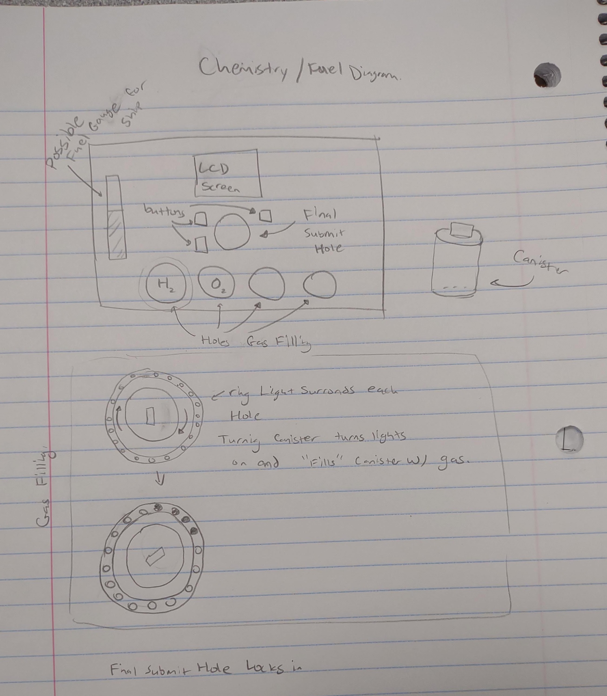

# Chemistry Fuel Panel
The chemistry fuel panel will be interacted with using a prop canister that is inserted into several holes in the panel. Each hole can use a pair of hall effect sensors to detect both the presense and direction of the canister. The canister will rotate freely in some holes which can be used as a selection mechanism, and it will lock in others to test if you have successfully completed the puzzle. Each of the free spinning holes will allow you to "select a gas level" for whatever that hole contains e.g. Oxygen. There will be a ring of leds around the hole that can give a visual readout of how much gas they are filling the canister with alongside a button to confirm that they have the desired gas level. Once mixing is complete they can insert the canister into the locking output to see if their chemistry experiment was a success. Some puzzles could be very easy, only requiring the correct balance of plain elements, while some could mix more complex chemicals and have to balance the pressure in the canister.

On the panel an LCD screen will show which chemicals are currently assigned to each filling port (the free spinning ones), the desired product chemical, and any other information that may change on the fly and can't be communicated with just the lights. There would be a manual with instructions on how to use the panel alongside some useful resources like a periodic table and some example problems.

If there is enough time and space we might even add a way to fuel the ship's generators by synthesysing fuel right at the chemistry panel and filling up the generator. They might also need to route power or manage waste products from the generator.

##  Parts
- 10 hall effect sensors 
- 5 ring lights, 1 per hole in the panel
- LCD screen
- 3 buttons
- 3 12v solenoid cabinet locks
- 1 Really long LED strip

## Diagram

